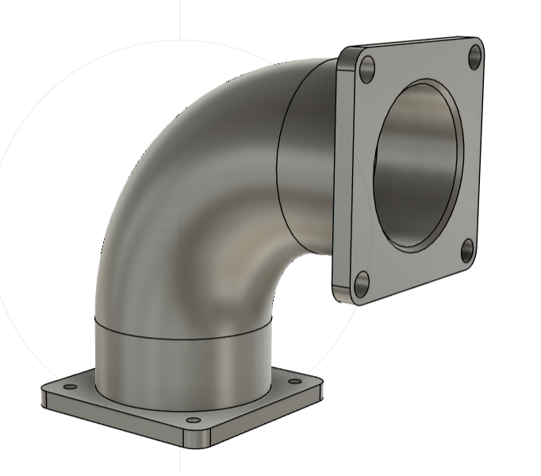

# Autodesk-Fusion-360

# 90° Flanged Elbow — Fusion 360 CAD Model

## Overview
This project models a 90-degree flanged elbow fitting designed in Autodesk Fusion 360. The part demonstrates CAD modeling fundamentals including circular geometry, swept pipe features, hole patterning, and flange assembly preparation.

## Objective
Replicate a flanged elbow pipe component from a provided 2D technical drawing while maintaining dimensional accuracy and manufacturable geometry. This type of component is commonly used for industrial fluid transfer and pneumatic routing.

---

## Specifications & Commands

| **Design Specifications** | **Fusion 360 Commands Demonstrated** |
|---------------------------|-------------------------------------|
| Bend Angle: 90°           | Pipe                                |
| Pipe Diameter: Ø80 mm     | Hole                                |
| Flange Width: 120 mm      | Circular Pattern                     |
| Circular Bolt Pattern: 4 holes | Chamfer                        |
| Units: Millimeters (mm)   | 2D Sketching & Dimensioning         |

---

## Design Features
- Two bolt flanges for modular connection  
- Smooth internal bend for continuous flow  
- Standard circular hole pattern  
- Chamfered geometry for machinability and safety   

---

## Technical Drawing Source
Model was created based on the following 2D documentation:
- Orthographic views
- Centerlines
- Hole callouts
- Radii & diameters
- Linear dimensions

---

## Models

---

## CAD Downloads

- Fusion 360 (`Flanged Elbow.f3d`)
- Fusion 360 (`Flanged Elbow_.ipt`)
- STEP (`Flanged Elbow_.step`)
- STL (`Flanged Elbow.stl`)
- DWG (`Flanged Elbow_.dwg`)

Download these files below

[Download Flanged Elbow.zip](./Flanged%20Elbow.zip)

## Manufacturing Considerations
Possible manufacturing processes include:
- Casting + CNC finishing  
- Fabrication using bent tubing + welded flanges  

Bolt flanges support:
- sealed fittings  
- directional routing  
- pneumatic or fluid system integration

---

## Applications
Typical use cases include:
- HVAC and ducting  
- Pneumatic systems  
- Industrial machinery  
- Pump manifolds  
- Automotive & marine routing

---

## Reflection
This project demonstrates:
- interpretation of engineering prints  
- use of parametric CAD modeling  
- attention to dimensional fidelity  
- modular mechanical design intent  

Future improvements may include:
- tolerance specifications (GD&T)  
- bolt size standards  
- Bill of Materials (BOM)  
- FEA structural analysis  
- Flow simulation (CFD)

---

