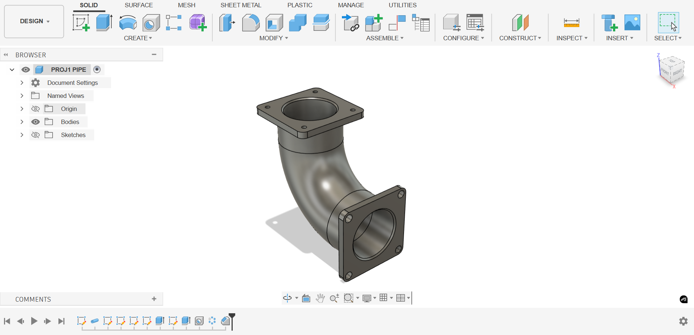
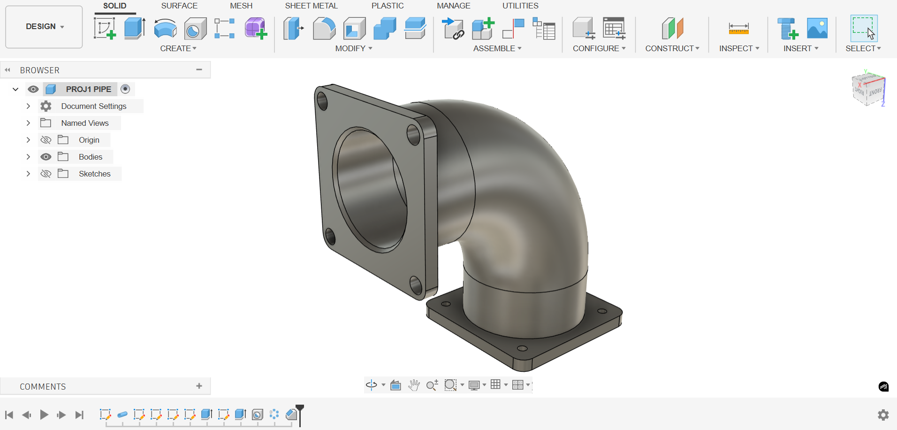
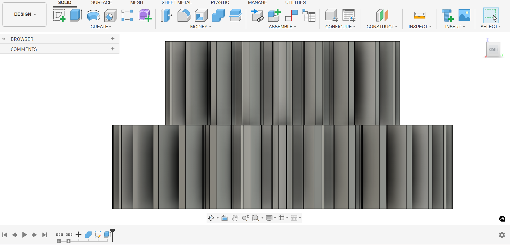
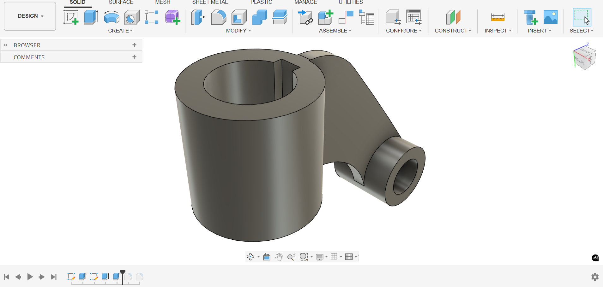
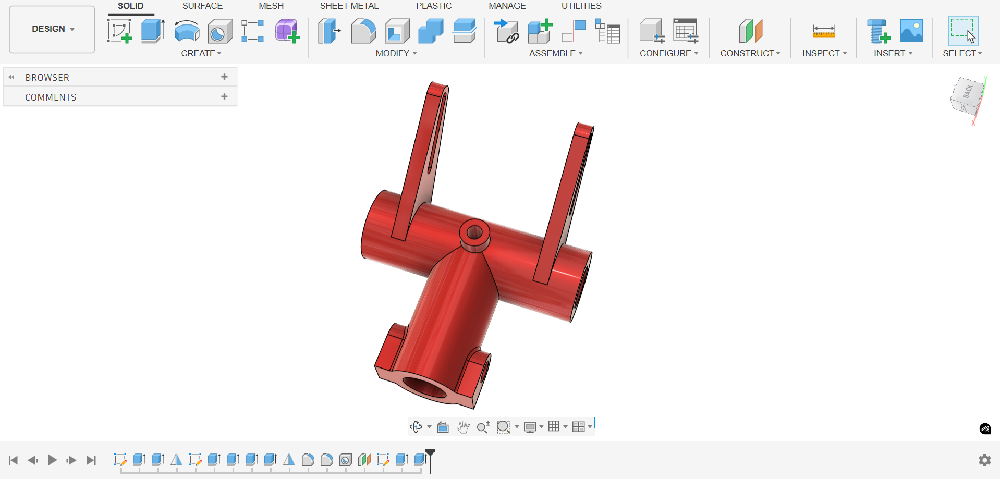
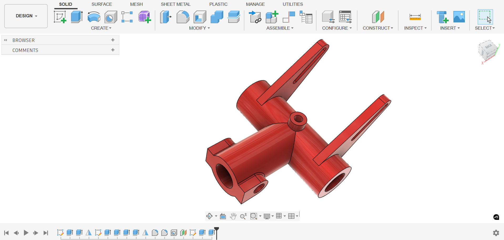
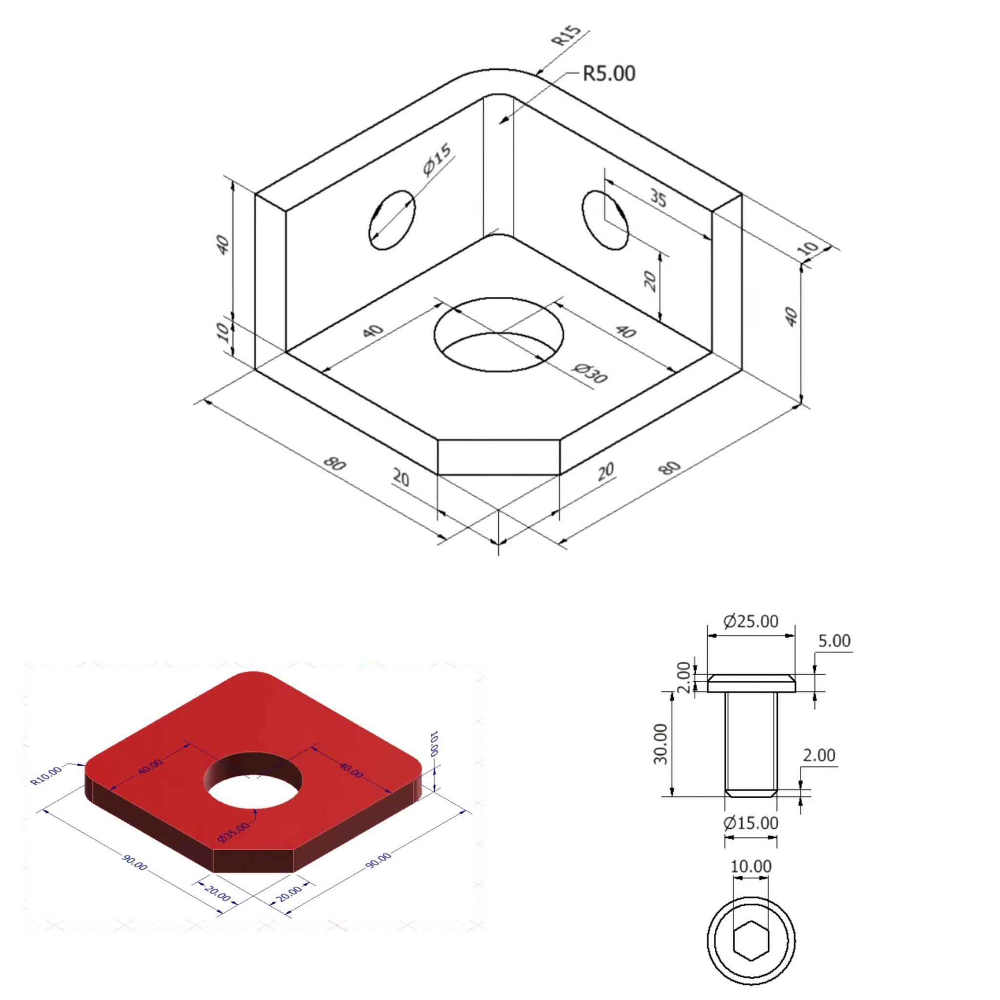
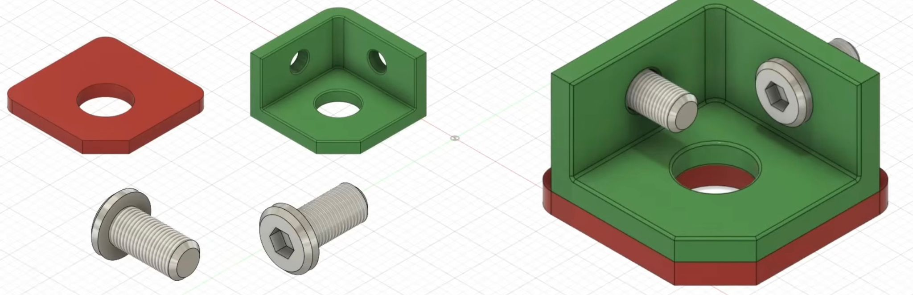
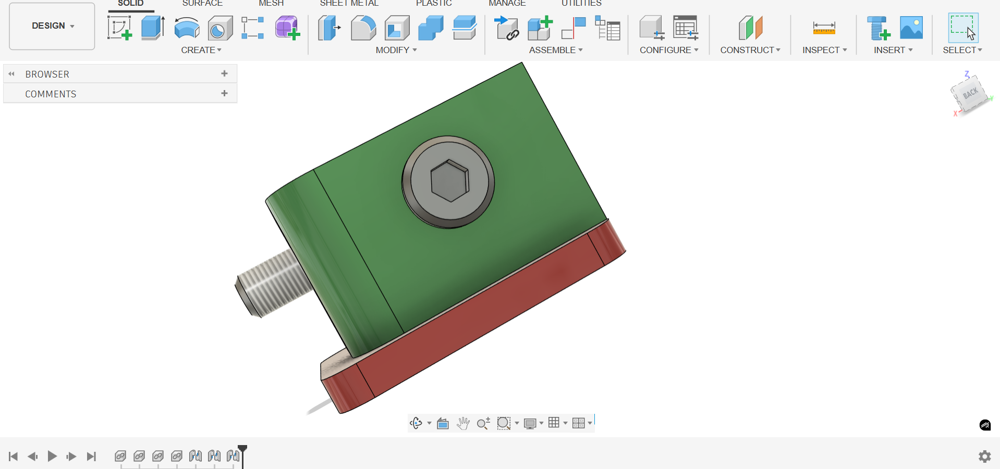
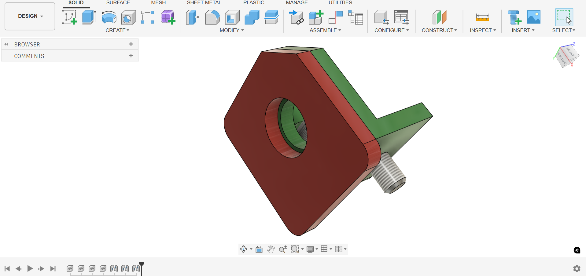

# Autodesk-Fusion-360

# 90° Flanged Elbow — Fusion 360 CAD Model

## Overview
This project models a 90-degree flanged elbow fitting designed in Autodesk Fusion 360. The part demonstrates CAD modeling fundamentals including circular geometry, swept pipe features, hole patterning, and flange assembly preparation.

## Objective
Replicate a flanged elbow pipe component from a provided 2D technical drawing while maintaining dimensional accuracy and manufacturable geometry. This type of component is commonly used for industrial fluid transfer and pneumatic routing.

---

## Specifications & Commands

| **Design Specifications** | **Fusion 360 Commands Demonstrated** |
|---------------------------|-------------------------------------|
| Bend Angle: 90°           | Pipe                                |
| Pipe Diameter: Ø80 mm     | Hole                                |
| Flange Width: 120 mm      | Circular Pattern                     |
| Circular Bolt Pattern: 4 holes | Chamfer                        |
| Units: Millimeters (mm)   | 2D Sketching & Dimensioning         |

---

## Design Features
- Two bolt flanges for modular connection  
- Smooth internal bend for continuous flow  
- Standard circular hole pattern  
- Chamfered geometry for machinability and safety   

---

## Technical Drawing Source
Model was created based on the following 2D documentation:
- Orthographic views
- Centerlines
- Hole callouts
- Radii & diameters
- Linear dimensions

---

## Models

---

## CAD Downloads

- Fusion 360 (`Flanged Elbow.f3d`)
- Fusion 360 (`Flanged Elbow_.ipt`)
- STEP (`Flanged Elbow_.step`)
- STL (`Flanged Elbow.stl`)
- DWG (`Flanged Elbow_.dwg`)

Download these files below

[Download Flanged Elbow.zip](./fusionassets/Flanged%20Elbow.zip)

## Manufacturing Considerations
Possible manufacturing processes include:
- Casting + CNC finishing  
- Fabrication using bent tubing + welded flanges  

Bolt flanges support:
- sealed fittings  
- directional routing  
- pneumatic or fluid system integration

---

## Applications
Typical use cases include:
- HVAC and ducting  
- Pneumatic systems  
- Industrial machinery  
- Pump manifolds  
- Automotive & marine routing

---

## Reflection
This project demonstrates:
- interpretation of engineering prints  
- use of parametric CAD modeling  
- attention to dimensional fidelity  
- modular mechanical design intent  

Future improvements may include:
- tolerance specifications (GD&T)  
- bolt size standards  
- Bill of Materials (BOM)  
- FEA structural analysis  
- Flow simulation (CFD)

---

# Compound Spur Gear — Fusion 360 CAD Model

## Overview
This project models a compound spur gear (two coaxial spur gears of different diameters and thicknesses) designed in Autodesk Fusion 360. The model demonstrates accurate involute gear tooth generation, compound gear design, precise pitch diameter control, and mounting bore specification.

## Objective
Replicate the compound spur gear using the exact provided dimensions to ensure proper tooth geometry, meshing compatibility, and manufacturable features. The design is intended for mechanical power transmission requiring a gear ratio of 30:20 (3:2).

## Design Specifications

**Module:** 12.7 mm  
**Pressure Angle:** 20°  
**Size Ratio:** Pitch Diameter / Number of Teeth (Metric)

| Parameter              | Large Gear      | Small Gear       |
|------------------------|-----------------|------------------|
| Number of Teeth        | 30              | 20               |
| Module                 | 12.7 mm         | 12.7 mm          |
| Pitch Diameter         | 381.00 mm       | 254.00 mm        |
| Gear Thickness         | 12 mm           | 100.0 mm         |
| Hole Diameter          | 12.7 mm         | 12.7 mm          |
| Root Fillet Radius     | 1.6 mm          | 1.6 mm           |
| Backlash               | 0.0 mm          | 0.0 mm           |
| Pressure Angle         | 20°             | 20°              |

## Tools Used
- **Autodesk Fusion 360**

## Fusion 360 Commands Demonstrated
- Spur Gear tool (or custom involute profile generation)
- Extrude
- Circular Pattern
- Fillet
- Hole
- 2D Sketching & Dimensioning
- Measure / Inspect

## Design Features
- Compound spur gear with two different diameters on a shared axis
- Standard 20° involute tooth profile
- Large gear (30 teeth, 12 mm thick) and small gear (20 teeth, 100 mm thick)
- Central through-hole Ø12.7 mm for shaft mounting
- Root fillet radius of 1.6 mm to reduce stress concentration
- Zero backlash specification

## Technical Drawing Source
Model created directly from the provided dimensional specifications (module, tooth counts, pitch diameters, thicknesses, hole size, and fillet radius). No external 2D drawing was used and dimensions were entered parametrically.

## Models

---

## CAD Downloads

- Fusion 360 (`Compound Spur Gear.f3d`)
- Fusion 360 (`Compound Spur Gear_.ipt`)
- STEP (`Compound Spur Gear_.step`)
- STL (`Compound Spur Gear.stl`)
- DWG (`Compound Spur Gear_.dwg`)

Download these files below

[Download Compound Spur Gear.zip](./fusionassets/Compound%20Spur%20Gear.zip)

## Manufacturing Considerations
Recommended processes:
- CNC gear hobbing or milling for tooth profile accuracy
- Wire EDM for high-precision prototypes
- 3D printing (metal or high-strength polymer) for functional prototypes
- Precision boring for the Ø12.7 mm central hole

## Applications
Typical use cases include:
- Gearboxes and speed reducers
- Robotics and automation actuators
- Industrial machinery drives
- Conveyor systems
- Custom mechanical transmissions

## Reflection
This project demonstrates:
- Parametric modeling of involute gear geometry
- Compound gear design principles
- Accurate control of module, pressure angle, and pitch diameter
- Attention to manufacturability (fillets, bore size, thickness variation)

Future improvements may include:
- GD&T and tolerance stack-up
- Gear meshing simulation and interference check
- FEA stress analysis
- Assembly with mating pinion and shaft
- Bill of Materials (BOM)

---

# Offset Crank Arm/Bellcrank Lever - Fusion 360 CAD Model

## Overview
This Fusion 360 model represents an **offset bellcrank** (also known as an offset crank arm or angled lever arm), a common mechanical linkage component used to transmit rotary motion between non-collinear axes or to change the direction of force application.

The part features two large bearing/journal interfaces connected by a curved, reinforced web with generous fillets and smooth transitions, making it suitable for moderate-load pivoting or actuating mechanisms.

## Objective
Accurately recreate the geometry from the provided technical sketch using only 2D sketching, arcs, tangency constraints, extrusion, symmetry, and fillets, while preserving all critical dimensions and manufacturing-friendly features.

## Design Specifications
All dimensions in **millimeters (mm)**

| Feature                          | Dimension          | Notes                              |
|----------------------------------|--------------------|------------------------------------|
| Large boss / bearing OD          | Ø50                | One end (thicker section)          |
| Large boss / bearing ID          | Ø30                | Through bore                       |
| Small boss / pivot OD            | Ø30                | Opposite end                       |
| Small boss / pivot ID            | — (implied solid)  | May be modified for shaft/keyway   |
| Center distance (between bores)  | 125                | Along arc path                     |
| Web / arm thickness              | 10                 | Constant thickness extrusion       |
| Offset / arm width at large end  | 80                 | Total width                        |
| Offset / arm width at small end  | 50                 | Total width                        |
| Curved outer radius (main bend)  | R50                | Outer profile                      |
| Inner relief radius              | R40                | Near small boss                    |
| Transition fillet (small end)    | R25                | Stress relief                      |
| Straight section length (large)  | 40                 | Before curve                       |
| Straight section length (small)  | 15                 | After curve                        |
| Total length (approx.)           | ~165–170           | Along centerline                   |

## Tools & Commands Demonstrated
- Sketch → Line, Arc (3-point & tangent), Circle
- Sketch constraints → Tangent, Coincident, Horizontal/Vertical, Dimension
- Mirror / Symmetry (for symmetrical web)
- Extrude (symmetric & one-direction)
- Fillet (variable radius: R25, R40, R50 regions)
- Inspect → Measure (validation of center distance & radii)

## Design Features
- Symmetrical web about the mid-plane
- Smooth tangent arc transitions → reduced stress concentration
- Generously filleted junctions → improved fatigue resistance
- Through-bore on large end (Ø30) suitable for bearing or bushing
- Thicker large-diameter boss → higher load capacity at that interface
- Offset geometry allowing compact linkage routing

 ## Models

---

## CAD Downloads

- Fusion 360 (`Offset Crank Arm.f3d`)
- Fusion 360 (`Offset Crank Arm_.ipt`)
- STEP (`Offset Crank Arm_.step`)
- STL (`Offset Crank Arm.stl`)
- DWG (`Offset Crank Arm_.dwg`)

Download these files below

[Download Offset Crank Arm.zip](./fusionassets/Offset%20Crank%20Arm.zip)

## Manufacturing Considerations
Most suitable processes:
- CNC milling from aluminum or steel plate (3-axis with good fillet access)
- Casting (steel, ductile iron, aluminum) + light machining
- 3D printing (metal DMLS / polymer SLS) for prototypes
- Forging possible for high-volume steel production

Recommended materials (depending on load):
- 7075-T6 or 6061-T6 aluminum
- C45 / 1045 steel
- Ductile iron (GGG40)

## Applications
Typical real-world uses include:
- Motorcycle / bicycle brake & gear shift linkages
- Agricultural equipment control levers
- Industrial valve / damper actuators
- Robotics joint actuation arms
- Automotive throttle & clutch linkages
- Exercise equipment pivot arms

---
 # Yoke / Clevis Fork with Offset Arm — Fusion 360 CAD Model

## Overview
This Fusion 360 model represents a **yoke-style clevis fork** (also called a clevis bracket, forked end, or yoke connector) with an integrated offset lever arm. The component is commonly used in mechanical linkages, control systems, actuators, and hydraulic/pneumatic cylinder connections where a forked end must attach to a clevis pin while transmitting motion or force at an angle.

## Objective
Reproduce the geometry from the provided orthographic and isometric sketch with high dimensional fidelity using sketching tools, extrusions, mirrors, fillets, and offset operations, suitable as an educational CAD exercise or functional prototype part.

## Design Specifications
All dimensions in **millimeters (mm)**

| Feature                          | Dimension              | Notes / Location                          |
|----------------------------------|------------------------|--------------------------------------------|
| Fork (clevis) width (inside)     | 10 mm                  | Gap between fork arms                      |
| Fork arm thickness               | 10 mm                  | Each prong                                 |
| Fork outer diameter (boss)       | Ø50 mm                 | Main cylindrical body at fork end          |
| Fork through bore                | Ø20 mm                 | Central hole through cylindrical boss      |
| Fork pin hole diameter           | Ø10 mm                 | Holes in both fork arms                    |
| Fork arm length (from center)    | ~40 mm                 | Approximate from main axis                 |
| Main cylinder diameter           | Ø30 mm                 | Central tubular section                    |
| Offset arm length (center-to-center) | 50 mm              | From main Ø30 axis to small Ø10 hole       |
| Offset arm angle                 | 135°                   | Arc angle of the curved lever              |
| Curved arm outer radius          | R (implied ~58–60)     | Derived from 135° and 50 mm centers        |
| Small end boss diameter          | Ø10 mm (hole)          | End of lever arm                           |
| Fillet — fork root               | R25 / R30              | Two different radii at fork junction       |
| Fillet — small end transition    | R7.5 mm                | At Ø10 hole area                           |
| Fillet — arm curve relief        | R8 mm                  | Inner relief on curved section             |
| Overall length (approx.)         | ~75–80 mm              | End-to-end along main axis + arm           |

## Tools & Commands Demonstrated
- Sketch → Circle, Line, Arc (center + angle), Slot (rectangular or rounded)
- Constraints → Tangent, Coincident, Symmetric, Dimension
- Mirror (for symmetrical fork arms)
- Extrude (normal + offset plane)
- Hole (simple & counterbore if needed)
- Fillet (multiple radii: R7.5, R8, R25, R30)
- Revolve (possible for main Ø30 tube — optional)

  ## Models

---

## CAD Downloads

- Fusion 360 (`Clevis Fork.f3d`)
- Fusion 360 (`Clevis Fork_.ipt`)
- STEP (`Clevis Fork_.step`)
- STL (`Clevis Fork.stl`)
- DWG (`Clevis Fork_.dwg`)

Download these files below

[Download Clevis Fork.zip](./fusionassets/Clevis%20Fork.zip)

## Design Features
- Symmetrical fork (clevis) with through pin hole Ø10 mm
- Central cylindrical body Ø30 mm × ~50 mm long
- 135° offset curved lever arm ending in Ø10 mm hole
- Smooth fillet transitions at all junctions → good fatigue behavior
- Constant 10 mm thickness on fork arms and lever web
- No draft angles → suitable for machining or 3D printing

## Manufacturing Considerations
Most suitable processes:
- CNC milling (3- or 4-axis) from aluminum or steel block
- 3-axis machining with ball end mills for fillets
- Metal 3D printing (DMLS / SLM) for prototypes
- Casting (aluminum or ductile iron) + finish machining

Common materials:
- 6061-T6 or 7075-T6 aluminum
- 1045 / C45 steel
- Stainless steel 304 / 316 (corrosion resistance)

## Typical Applications
- Hydraulic / pneumatic cylinder rod ends
- Control linkages (throttle, brake, steering)
- Agricultural machinery pivot points
- Robotics arm joints & actuators
- Automotive & motorcycle suspension links
- Exercise equipment adjustment mechanisms

---

# L-Bracket with Shoulder Bolt & Washer — Fusion 360 CAD Model

## Overview
This project contains a complete parametric model of a reinforced **L-shaped mounting bracket** (angle bracket / corner bracket) together with a matching **shoulder bolt** (stripper bolt / shoulder screw) and a thick **washer/spacer**.

The assembly demonstrates:
- A robust 90° bracket with rounded external corners and internal fillets
- Counterbored mounting holes for flush or semi-flush fastening
- Central clearance/alignment bore Ø30 mm
- Matching high-strength shoulder screw with hex socket drive
- Thick locating washer to act as a standoff or bearing surface

Typical use case: structural connection in machine frames, fixtures, jigs, automation equipment, robotic cells, or any application requiring a strong right-angle joint with precise alignment.

## Design Specifications
All dimensions in **millimeters (mm)**

### L-Bracket (Green part)
| Feature                        | Value                  | Notes                                      |
|--------------------------------|------------------------|--------------------------------------------|
| Overall base size              | 80 × 80 mm             | Outer envelope (square)                    |
| Wall / flange thickness        | 10 mm                  | Both legs                                  |
| External corner radii          | R15 mm & R5 mm         | Two-stage rounding                         |
| Internal fillet radius         | R15 mm                 | Stress relief at inside corner             |
| Mounting hole diameter         | Ø15 mm                 | Two holes per leg                          |
| Mounting hole spacing (center) | 35 mm (horizontal)     | From inside corner                         |
| Central clearance bore         | Ø30 mm                 | Through both legs                          |
| Base chamfer / edge break      | ~1–2 mm (implied)      | All external edges                         |

### Washer / Spacer (Red part)
| Feature                        | Value                  | Notes                                      |
|--------------------------------|------------------------|--------------------------------------------|
| Outer shape                    | Square with chamfered corners | 90 × 90 mm overall                       |
| Thickness                      | 10 mm                  | Thick standoff / bearing face              |
| Central bore                   | Ø30 mm                 | Matches bracket bore                       |
| Outer corner radii             | R10 mm                 | All four corners                           |
| Edge chamfer                   | 2 mm × 45° (implied)   | Top and bottom perimeter                   |

### Shoulder Bolt (Silver parts)
| Feature                        | Value                  | Notes                                      |
|--------------------------------|------------------------|--------------------------------------------|
| Thread diameter                | M10 (implied)          | Coarse thread assumed                      |
| Shoulder diameter              | Ø15 mm                 | Precision locating diameter                |
| Shoulder length                | 30 mm                  | Functional grip length                     |
| Head diameter                  | Ø25 mm                 | Flanged socket head                        |
| Head thickness                 | 5 mm                   | Low-profile                                |
| Drive                          | Hex socket (Allen)     | 6 mm hex key                               |
| Thread length                  | ~20–25 mm (visible)    | Partial thread                             |

## Tools & Commands Demonstrated
- 2D sketching: Rectangle, Circle, Arc, Fillet, Offset, Mirror
- Extrude (symmetric & one-direction)
- Hole → Simple + Counterbore
- Chamfer / Fillet (multiple radii)
- Revolve (for shoulder bolt)
- Circular Pattern (optional for head hex)
- Assembly → Joints / As-built joints (concentric + planar)
- Appearance / Physical material assignment

## Design Features
- Symmetrical L-shape with equal legs
- Generous internal and external fillets → improved strength & aesthetics
- Precision Ø15 mm shoulder interface for accurate positioning
- Large Ø30 mm central clearance for shaft, sensor, or cable pass-through
- Thick washer doubles as protective spacer and load distributor
- Hex socket cap head for clean appearance and high torque capability

  ## Models

---

## CAD Downloads

- Fusion 360 (`L-Bracket.f3d`)
- Fusion 360 (`L-Bracket_.ipt`)
- STEP (`L-Bracket_.step`)
- STL (`L-Bracket.stl`)
- DWG (`L-Bracket_.dwg`)

Download these files below

[Download L-Bracket.zip](./fusionassets/L-Bracket.zip)

## Manufacturing Considerations
Recommended processes:
- **Bracket & Washer**  
  - CNC milling from aluminum plate (6061-T6 or 7075)  
  - Laser/plasma/waterjet + light machining  
  - Steel versions: flame-cut + machining  
- **Shoulder Bolt**  
  - Standard catalog part (DIN 923 / ISO 7379 style)  
  - Custom CNC turning + thread rolling

## Typical Applications
- Machine base & frame corner connections
- Fixture & jig mounting
- Automation / robotic cell structural joints
- Sensor or actuator mounting brackets
- Workholding systems
- Prototype machinery sub-assemblies

