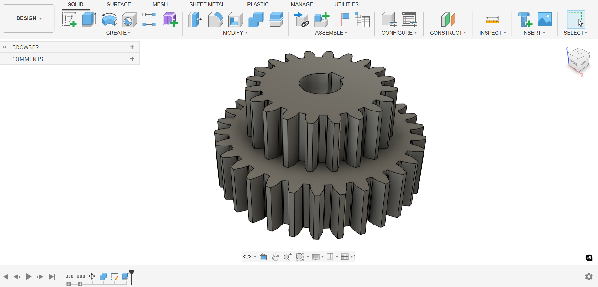

# Autodesk-Fusion-360

# 90° Flanged Elbow — Fusion 360 CAD Model

## Overview
This project models a 90-degree flanged elbow fitting designed in Autodesk Fusion 360. The part demonstrates CAD modeling fundamentals including circular geometry, swept pipe features, hole patterning, and flange assembly preparation.

## Objective
Replicate a flanged elbow pipe component from a provided 2D technical drawing while maintaining dimensional accuracy and manufacturable geometry. This type of component is commonly used for industrial fluid transfer and pneumatic routing.

---

## Specifications & Commands

| **Design Specifications** | **Fusion 360 Commands Demonstrated** |
|---------------------------|-------------------------------------|
| Bend Angle: 90°           | Pipe                                |
| Pipe Diameter: Ø80 mm     | Hole                                |
| Flange Width: 120 mm      | Circular Pattern                     |
| Circular Bolt Pattern: 4 holes | Chamfer                        |
| Units: Millimeters (mm)   | 2D Sketching & Dimensioning         |

---

## Design Features
- Two bolt flanges for modular connection  
- Smooth internal bend for continuous flow  
- Standard circular hole pattern  
- Chamfered geometry for machinability and safety   

---

## Technical Drawing Source
Model was created based on the following 2D documentation:
- Orthographic views
- Centerlines
- Hole callouts
- Radii & diameters
- Linear dimensions

---

## Models

---

## CAD Downloads

- Fusion 360 (`Flanged Elbow.f3d`)
- Fusion 360 (`Flanged Elbow_.ipt`)
- STEP (`Flanged Elbow_.step`)
- STL (`Flanged Elbow.stl`)
- DWG (`Flanged Elbow_.dwg`)

Download these files below

[Download Flanged Elbow.zip](./Flanged%20Elbow.zip)

## Manufacturing Considerations
Possible manufacturing processes include:
- Casting + CNC finishing  
- Fabrication using bent tubing + welded flanges  

Bolt flanges support:
- sealed fittings  
- directional routing  
- pneumatic or fluid system integration

---

## Applications
Typical use cases include:
- HVAC and ducting  
- Pneumatic systems  
- Industrial machinery  
- Pump manifolds  
- Automotive & marine routing

---

## Reflection
This project demonstrates:
- interpretation of engineering prints  
- use of parametric CAD modeling  
- attention to dimensional fidelity  
- modular mechanical design intent  

Future improvements may include:
- tolerance specifications (GD&T)  
- bolt size standards  
- Bill of Materials (BOM)  
- FEA structural analysis  
- Flow simulation (CFD)

---

# Compound Spur Gear — Fusion 360 CAD Model

## Overview
This project models a compound spur gear (two coaxial spur gears of different diameters and thicknesses) designed in Autodesk Fusion 360. The model demonstrates accurate involute gear tooth generation, compound gear design, precise pitch diameter control, and mounting bore specification.

## Objective
Replicate the compound spur gear using the exact provided dimensions to ensure proper tooth geometry, meshing compatibility, and manufacturable features. The design is intended for mechanical power transmission requiring a gear ratio of 30:20 (3:2).

## Design Specifications

**Module:** 12.7 mm  
**Pressure Angle:** 20°  
**Size Ratio:** Pitch Diameter / Number of Teeth (Metric)

| Parameter              | Large Gear      | Small Gear       |
|------------------------|-----------------|------------------|
| Number of Teeth        | 30              | 20               |
| Module                 | 12.7 mm         | 12.7 mm          |
| Pitch Diameter         | 381.00 mm       | 254.00 mm        |
| Gear Thickness         | 12 mm           | 100.0 mm         |
| Hole Diameter          | 12.7 mm         | 12.7 mm          |
| Root Fillet Radius     | 1.6 mm          | 1.6 mm           |
| Backlash               | 0.0 mm          | 0.0 mm           |
| Pressure Angle         | 20°             | 20°              |

## Tools Used
- **Autodesk Fusion 360**

## Fusion 360 Commands Demonstrated
- Spur Gear tool (or custom involute profile generation)
- Extrude
- Circular Pattern
- Fillet
- Hole
- 2D Sketching & Dimensioning
- Measure / Inspect

## Design Features
- Compound spur gear with two different diameters on a shared axis
- Standard 20° involute tooth profile
- Large gear (30 teeth, 12 mm thick) and small gear (20 teeth, 100 mm thick)
- Central through-hole Ø12.7 mm for shaft mounting
- Root fillet radius of 1.6 mm to reduce stress concentration
- Zero backlash specification

## Technical Drawing Source
Model created directly from the provided dimensional specifications (module, tooth counts, pitch diameters, thicknesses, hole size, and fillet radius). No external 2D drawing was used and dimensions were entered parametrically.

## Models

---

## CAD Downloads

- Fusion 360 (`Compound Spur Gear.f3d`)
- Fusion 360 (`Compound Spur Gear_.ipt`)
- STEP (`Compound Spur Gear_.step`)
- STL (`Compound Spur Gear.stl`)
- DWG (`Compound Spur Gear_.dwg`)

Download these files below

[Download Compound Spur Gear.zip](./Compound%20Spur%20Gear.zip)

## Manufacturing Considerations
Recommended processes:
- CNC gear hobbing or milling for tooth profile accuracy
- Wire EDM for high-precision prototypes
- 3D printing (metal or high-strength polymer) for functional prototypes
- Precision boring for the Ø12.7 mm central hole

## Applications
Typical use cases include:
- Gearboxes and speed reducers
- Robotics and automation actuators
- Industrial machinery drives
- Conveyor systems
- Custom mechanical transmissions

## Reflection
This project demonstrates:
- Parametric modeling of involute gear geometry
- Compound gear design principles
- Accurate control of module, pressure angle, and pitch diameter
- Attention to manufacturability (fillets, bore size, thickness variation)

Future improvements may include:
- GD&T and tolerance stack-up
- Gear meshing simulation and interference check
- FEA stress analysis
- Assembly with mating pinion and shaft
- Bill of Materials (BOM)

